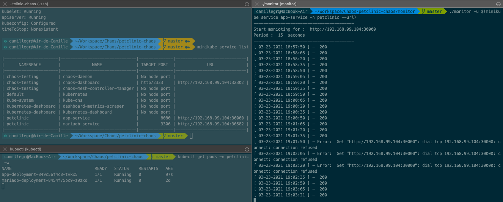
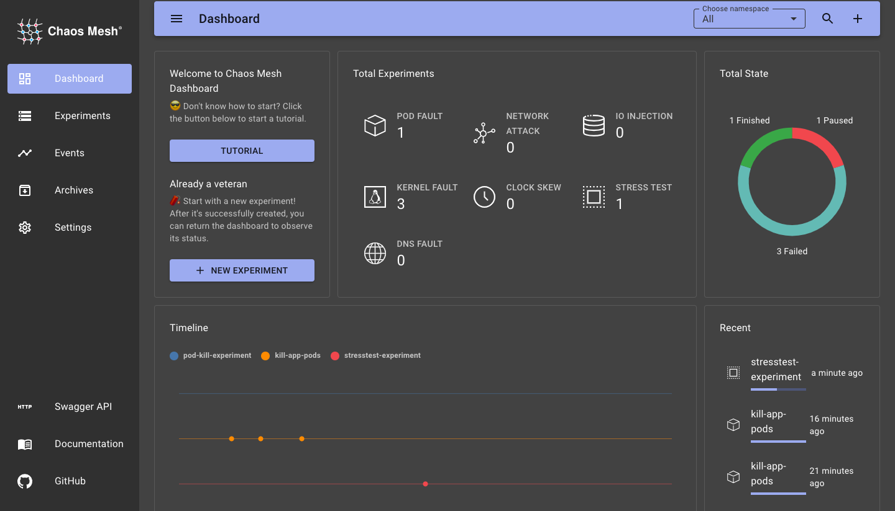

# Chao à la clinique vétérinaire

Ce dépôt contient un simple déploiement de l'application Petclinic (Spring-Boot) sur Kubernetes. A cela on ajoute du chaos engineering avec Chaos Mesh. Le déploiement n'a été été testé que sur minikube.

## Dockerfile

Le Dockerfile permet de faire créer l'image qui se trouve sur quay.io/camillegr/petclinic. Le Dockerfile se trouve dans le dossier petclinic-container.

## Kubernetes

Dans le namespace Petclinic, on déploie seulement 2 types de ressources pour Petclinic :
* Les deployments qui définissent le déploiement mariadb et le déploiement de petclinic avec 2 replicas.
* Les services Mariadb et l'application Petclinic (Spring-boot).

Chaos-Mesh utilise les CRD pour créer des experimentations.

## Lancer Petclinic et Chaos-Mesh


Pour lancer Petclinic :

```
./start-petclinic.sh
```

qui va :
- Créer les déploiements/services de petclinic.
- Installer Helm sur minikube.
- Installer Chaos-Mesh.
- Lancer les dahsboards minikube et chaos-mesh.

## Monitoring

Pour faire simple, on utilisera le script monitor/mainpage-monitor.py pour vérifier la disponibilité du site :

```
cd monitor/
go build
./monitor -u $(minikube service app-service -n petclinic --url) -p 5
```

Avec une supression de pods toute les deux minutes on obtient cette sortie :



chaos-mesh fournit également un tableau de bord pour suivre les expérimentations :


